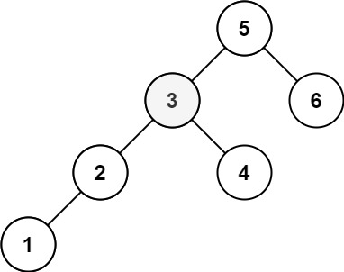

# Laboratorio 01

## Instrucciones

1. Para iniciar, debe crear un *Fork* del repositorio:


2. Vaya la pestaña de **actions** de su repositorio. Si ve un botón verde, haga clic en él para poder ejecutar las pruebas en el futuro.


3. Clone el nuevo repositorio en su computadora y ábralo en IntelliJ.

4. Construya/compile la aplicación en IntelliJ.

5. Ejecute las pruebas unitarias.

6. No se preocupe si todas o la mayoría de las pruebas fallan. Al terminar el laboratorio, todas las pruebas deberían funcionar.
___

## Introducción

- Todos los ejercicios deben compilar para poder ser probados. Si por lo menos uno de los ejercicios no compila, la nota sera de **cero** puntos.
- Si el código original de un ejercicio no se modifica o la intención de su resolución no es clara, la nota del ejercicicio será de **cero puntos**, aún si hay pruebas que sí pasen para dicho ejercicio.
- NO agregue nuevos métodos `main()`, de lo contrario ninguna prueba podrá ejecutarse.
- NO cambie la firma de los métodos existentes (no agrege más parámetros ni cambie el nombre), estos son utilizados para probar su código.
- NO haga cambios en las pruebas, esto resulta en un **cero inmediato**.
- Puede agregar nuevas clases y/o archivos, como sea necesario.
- En la pestaña de **Actions** podrá ver como las pruebas se ejecutan con su código implementado (si hace `git push` de un nuevo commit previamente).
___

## Ejercicio 1

Dado el nodo `root` de un árbol binario, invierta el árbol y retorne su raíz.

### Ejemplo 1.1


```
root = [4,2,7,1,3,6,9]
resultado = [4,7,2,9,6,3,1]
```

### Ejemplo 1.2


```
root = [2,1,3]
resultado = [2,3,1]
```

### Ejemplo 1.3

```
root = []
resultado = []
```

### Restricciones
- La cantidad de nodos de un árbol se encuentra en el rango `[0,100]`.
- Los valores de los nodos se encuentran en el rango `[-100,100]`.

___

## Ejercicio 2

Dado el nodo `root` de un **árbol binario de búsqueda**, y un entero `k`, retorne el k-ésimo elemento más pequeño de todos los valores dentro del árbol.

### Ejemplo 2.1


```
root = [3,1,4,null,2], k = 1
resultado = 1
```

### Ejemplo 2.2



```
root = [5,3,6,2,4,null,null,1], k = 3
resultado = 3
```

___

## Ejercicio 3

Diseñe un [Árbol AVL](https://docs.google.com/presentation/d/1P_buvNRP-Hg6tWjlCQv6hDBCp-gQZ43p09UZV_VUq9M/edit?usp=sharing).

Implemente los métodos de la clase `E03AVLTree`:

- `E03AVLTree(Comparator<T> comparator)` instancia un árbol AVL, definiendo el comparador.
- `void insert(T value)` inserta un valor `value`, utilizando `comparator`, en el árbol AVL. Tomar en cuenta que el árbol siempre debe estar balanceado después de cada llamada a **insert**.
- `void delete(T value)` elimina un valor `value`. Después de cada llamada a **delete**, el árbol debe permanecer balanceado.
- `T search(T value)` busca un valor `value` dentro del árbol AVL. Si el valor se encuentra, se retorna, de lo contrario se retorna `null`.
- `int height()` retorna la altura del árbol.
- `int size()` retorna la cantidad de nodos dentro del árbol.

### Ejemplo 3.1

```java
E03AVLTree<Integer> avlTree = new E03AVLTree<>(Integer::compare); // Crea un árbol AVL de números enteros.
avlTree.search(5); // retorna null porque el árbol está vacío
avlTree.insert(5); // almacena 5 en el árbol AVL
avlTree.insert(3); // almacena 3 en el árbol AVL
avlTree.insert(1); // almacena 1 en el árbol AVL y lo rebalancea
avlTree.search(5); // retorna 5
avlTree.search(1); // retorna 1
avlTree.size(); // retorna 3
avlTree.height(); // retorna 2
avlTree.delete(3); // elimina 3
avlTree.search(3); // retorna null
avlTree.insert(4); // almacena 4 y rebalancea el árbol AVL
```